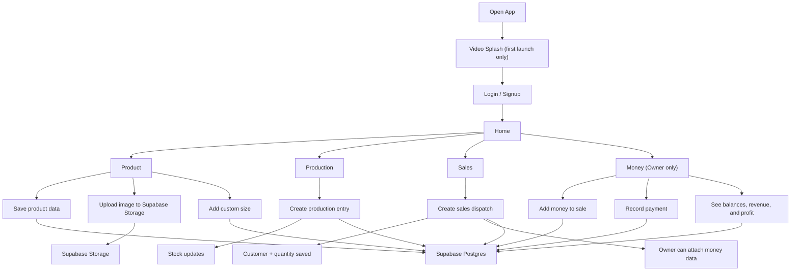

<p align="center">
  
</p>

<h1 align="center">Tracker</h1>

<p align="center">
  A simple Flutter + Supabase business tracker for product, production, sales, stock, loans, revenue, and profit.
</p>

<p align="center">
  <a href="apk/tracker-v1.0.0+5.apk"><strong>Download Latest APK</strong></a>
</p>

## Overview

`Tracker` is a lightweight mobile app built for a small real business workflow.

It is designed for:
- one main product
- simple pack sizes
- fast production and sales entry
- owner-only money access
- offline support with sync when internet comes back

## Features

- Product setup with image upload
- Custom pack sizes with liters, stock alert, and optional price
- Production tracking
- Sales tracking
- Customer balances and payment tracking
- Revenue and profit visibility for the owner
- Owner phone alias login support
- Offline queue and auto-sync
- Supabase backend with Auth, Postgres, and Storage
- Video splash screen on first app open

## Download

The latest tester APK is in this repository:

- [tracker-v1.0.0+5.apk](apk/tracker-v1.0.0+5.apk)

## Tech Stack

- Flutter
- Riverpod
- Supabase Auth
- Supabase Postgres
- Supabase Storage
- Shared Preferences
- Flutter Secure Storage
- Image Picker
- Video Player

## App Flow



## Project Structure

```text
tracker/
├── app/                # Flutter app
├── apk/                # Downloadable tester APK
├── scripts/            # Build and verification scripts
├── supabase/           # Database config and migrations
└── ui/                 # Design references
```

## Run Locally

### 1. Open the Flutter app

```bash
cd app
flutter pub get
flutter run
```

### 2. Build a release APK

From the workspace root:

```bash
python3 scripts/build_versioned_apk.py
```

This creates a versioned APK inside:

```text
app/build/releases/
```

## Backend

The app is connected to Supabase for:

- authentication
- database storage
- product image storage
- logs and activity data

When the device is online, the app saves to Supabase first.
When the device is offline, the app keeps changes locally and syncs them later.

## Notes

- `Money` is owner-only.
- Other users can still access shared product, production, and sales data.
- The repository is kept private for controlled project access.

## Contact

If you want a similar app:

- Telegram: [@muay011](https://t.me/muay011)
- Phone: `0907806267`
- GitHub: [black12-ag](https://github.com/black12-ag)

## Copyright

Copyright (c) 2026 Munir Kabir.
All rights reserved.

See [LICENSE](LICENSE) for usage restrictions.
