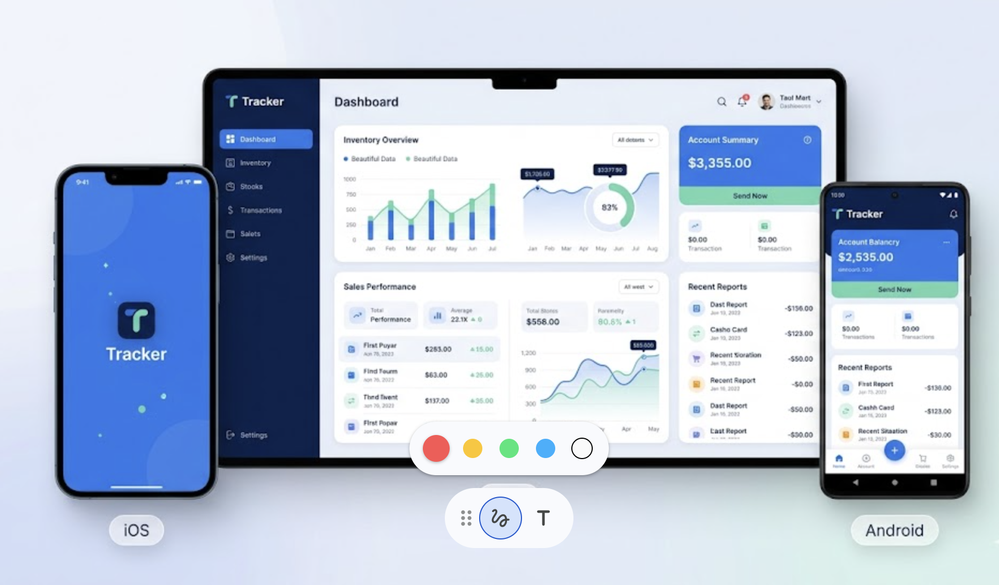
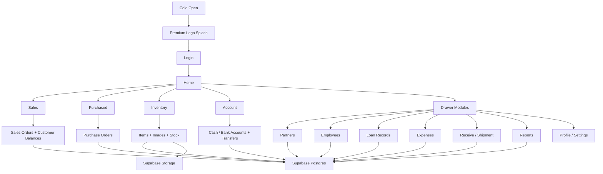

<p align="center">
  
</p>

<h1 align="center">Tracker</h1>

<p align="center">
  A professional Flutter + Supabase business tracker for inventory, sales, purchases, accounts, loans, reports, revenue, and profit.
</p>

<p align="center">
  <a href="apk/tracker-v1.0.0+10.apk"><strong>Download Latest APK</strong></a>
</p>

## UI Preview

Cross-platform Tracker showcase:

<p align="center">
  
</p>

Opening screen reference used for the app direction:

<p align="center">
  
</p>

## Latest Release

Current tester build: `v1.0.0+10`

Highlights in this release:
- premium logo-first splash animation
- smarter sales and purchase flows
- smart customer balance tracking with due dates
- owner/staff business workspace with reports, accounts, and inventory
- iPhone build fixes and synced CocoaPods workspace
- improved README and packaged tester APK in the repo

## Overview

`Tracker` is a mobile business app built for real small-business daily operations.

It is designed for:
- inventory and stock tracking
- sales and purchase order flows
- partner and customer management
- owner and staff access control
- account balances, transfers, loans, and expenses
- backend-driven revenue, overdue balances, and profit summaries
- offline-friendly use with sync when internet comes back

## Features

- Premium animated splash screen
- Inventory items with image upload
- Sales order and purchase order flows
- Partners, employees, loans, expenses, receive, shipment, and reports
- Smart customer balance tracking with due dates and reminder status
- Revenue, account totals, overdue balances, and profit visibility for the owner
- Owner phone alias login support
- Offline queue and auto-sync
- Supabase backend with Auth, Postgres, and Storage
- Local device notifications for overdue balances and pending actions

## Download

The latest tester APK is in this repository:

- [tracker-v1.0.0+10.apk](apk/tracker-v1.0.0+10.apk)

## Tech Stack

- Flutter
- Riverpod
- Supabase Auth
- Supabase Postgres
- Supabase Storage
- Shared Preferences
- Flutter Secure Storage
- Image Picker
- Flutter Local Notifications

## App Flow



## Project Structure

```text
tracker/
├── app/                # Flutter app
├── apk/                # Downloadable tester APKs
├── scripts/            # Build and verification scripts
├── supabase/           # Database config and migrations
└── ui/                 # Design references
```

## Run Locally

### 1. Open the Flutter app

```bash
cd app
flutter pub get
flutter run
```

### 2. Build a release APK

From the workspace root:

```bash
python3 scripts/build_versioned_apk.py
```

This creates a versioned APK inside:

```text
app/build/releases/
```

### 3. Install on a device with one script

From the workspace root:

```bash
./scripts/install_tracker.sh android
```

or

```bash
./scripts/install_tracker.sh ios-sim
```

or

```bash
./scripts/install_tracker.sh ios-device
```

What each mode does:
- `android`: installs the newest APK in `apk/` to a connected Android phone
- `ios-sim`: installs the built app to the currently booted iPhone simulator
- `ios-device`: opens Xcode workspace and shows the real iPhone install steps

## Install on iPhone

To test on an iPhone, use Xcode instead of the Android APK:

1. Open [Runner.xcworkspace](app/ios/Runner.xcworkspace) in Xcode.
2. Connect your iPhone to the Mac.
3. In Xcode, select the `Runner` target.
4. Open `Signing & Capabilities` and choose your Apple Team.
5. Select your iPhone as the run target.
6. Press `Run`.

Important:
- open the `.xcworkspace`, not the `.xcodeproj`
- if you see a CocoaPods sandbox mismatch, run `pod install` inside `app/ios`
- if the app icon or name looks cached, delete the old app from the phone and install again

The latest verified iPhone simulator build is created from the same codebase in:

```text
app/build/ios/iphonesimulator/Runner.app
```

## Backend

The app is connected to Supabase for:

- authentication
- database storage
- inventory image storage
- logs and activity data
- account and report calculations
- smart customer balance tracking

When the device is online, the app saves to Supabase first.
When the device is offline, the app keeps changes locally and syncs them later.

## Notes

- `Owner` can access finance, reports, accounts, expenses, loans, and staff management.
- `Staff` can access shared operational data without owner-only money controls.
- Revenue, overdue balances, and profit summaries are backend-driven.
- Android testers should use the APK in the `apk/` folder.
- iPhone testers should install through Xcode with the workspace above.
- The repository is kept private for controlled project access.

## Suggested GitHub Description

If you want to paste a short repo description on GitHub, use:

`Professional Flutter + Supabase business tracker for inventory, sales, accounts, reports, loans, and profit.`

## Contact

If you want a similar app:

- Telegram: [@muay011](https://t.me/muay011)
- Phone: `0907806267`
- GitHub: [black12-ag](https://github.com/black12-ag)

## Copyright

Copyright (c) 2026 Munir Kabir.
All rights reserved.

See [LICENSE](LICENSE) for usage restrictions.
